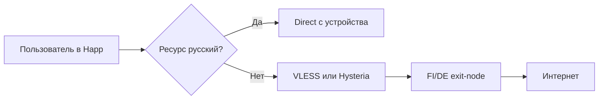
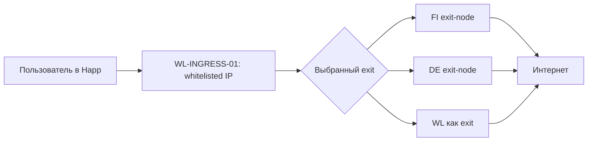

# 01_MAIN_ARCHITECTURE.md

# Главная архитектура VPN-сервиса

Дата фиксации архитектуры: 27.06.2026  
Проект: коммерческий VPN-сервис с Telegram-ботом, Happ-клиентом, админкой, контролем трафика и лимитом устройств.  
Рабочее название в документах: `Ghost Pepe VPN`, но в коде название должно лежать в переменных окружения, чтобы его можно было заменить без переписывания логики.

---

## 1. Жёсткие правила проекта

В проекте разрешены только два протокола подключения:

1. `VLESS` через `Xray-core`.
2. `Hysteria2`, далее в документах коротко называется `Hysteria`.

Другие протоколы не добавлять в пользовательские подписки, не показывать в админке как варианты продажи и не использовать как основной транспорт. В коде не должно появляться рабочих профилей WireGuard, OpenVPN, Shadowsocks, Trojan, VMess, TUIC и любых других протоколов.

На каждый exit-сервер обязательно формируются четыре пользовательских варианта подключения:

1. `VPN VLESS` — обычный VLESS-профиль, русские ресурсы идут напрямую с устройства пользователя.
2. `VPN Hysteria` — обычный Hysteria-профиль, русские ресурсы идут напрямую с устройства пользователя.
3. `Whitelist VLESS` — VLESS-профиль через whitelisted ingress-сервер, предназначенный для ситуаций, когда оператор оставляет доступ только к IP из белого списка.
4. `Whitelist Hysteria` — Hysteria-профиль через whitelisted ingress-сервер, предназначенный для такой же ситуации.

Главное правило whitelist-режима: клиентское приложение не должно подключаться напрямую к обычному FI/DE exit-IP, если выбран whitelist-вариант. В whitelist-варианте endpoint для пользователя всегда ведёт на whitelisted ingress-сервер. Иначе режим не поможет в ситуации, когда обычные адреса недоступны.

Русские ресурсы идут напрямую только в обычных профилях `VPN VLESS` и `VPN Hysteria`. В whitelist-профилях локальный direct для русских ресурсов отключается, потому что задача whitelist-режима — сохранить доступ через разрешённый IP.

---

## 2. Основные компоненты системы

Архитектура делится на две зоны: control-plane и data-plane.

### 2.1. Control-plane

Control-plane отвечает за пользователей, оплаты, подписки, устройства, статистику и админку.

Обязательные сервисы:

| Сервис | Назначение |
|---|---|
| `api-backend` | Главный REST API для бота, админки, подписок и node-agent. |
| `postgres` | Главная база данных пользователей, подписок, устройств, оплат, трафика и серверов. |
| `redis` | Очереди, короткие токены, rate limit, временные блокировки и кеши. |
| `telegram-bot` | Пользовательский бот для покупки, продления, просмотра подписки и управления устройствами. |
| `admin-web` | Админ-панель для статистики, серверов, пользователей, трафика и платежей. |
| `subscription-web` | Веб-страница импорта подписки с проверкой устройства и кнопками Happ. |
| `subscription-api` | Генерация подписок, Happ-заголовков, routing-профилей и link-токенов. |
| `stats-worker` | Регулярный сбор трафика с VLESS/Xray и Hysteria. |
| `billing-worker` | Обработка Telegram Stars, продлений, истечений и заморозок подписок. |
| `geo-rules-worker` | Обновление и проверка routing-правил для русских ресурсов. |

Control-plane лучше держать на основном сервере в Финляндии. Это не значит, что весь VPN-трафик идёт через Финляндию. Это значит, что база, бот, админка и подписки имеют один главный источник правды.

### 2.2. Data-plane

Data-plane отвечает за реальный пользовательский трафик.

Обязательные типы серверов:

| Тип сервера | Назначение |
|---|---|
| `exit-node` | Обычный VPN-сервер, через который выходит пользовательский трафик. Например, FI и DE. |
| `whitelist-ingress` | Сервер с IP в белом списке. Пользователь подключается к нему в whitelist-режиме. |
| `node-agent` | Локальный агент на каждом сервере. Передаёт health, load, трафик, состояние Xray/Hysteria. |

---

## 3. Минимальная топология

Минимально нужны три роли серверов:

1. `FI-CONTROL-01` — главный сервер control-plane и одновременно exit-node Финляндии.
2. `DE-EXIT-01` — exit-node Германии.
3. `WL-INGRESS-01` — whitelisted ingress-сервер, например сервер в Yandex Cloud или другой инфраструктуре, IP которого реально находится в белом списке нужной сети.

Если whitelisted-сервер также должен быть отдельным exit-сервером, он может работать в двух режимах:

1. `ingress` — принимает пользователей в whitelist-профилях и пересылает трафик на выбранный exit.
2. `exit` — сам выпускает трафик в интернет со своего IP.

---

## 4. Четыре профиля на каждый exit-сервер

Для каждого exit-сервера система создаёт четыре профиля. Пример для Финляндии:

| Профиль | Клиентский endpoint | Реальный маршрут | RU direct |
|---|---|---|---|
| `FI VPN VLESS` | `fi-vless.example.com:443` | Пользователь → FI → интернет | Да |
| `FI VPN Hysteria` | `fi-hy.example.com:443/udp` | Пользователь → FI → интернет | Да |
| `FI Whitelist VLESS` | `wl-vless.example.com:443` | Пользователь → WL → FI → интернет | Нет |
| `FI Whitelist Hysteria` | `wl-hy.example.com:443/udp` | Пользователь → WL → FI → интернет | Нет |

Пример для Германии:

| Профиль | Клиентский endpoint | Реальный маршрут | RU direct |
|---|---|---|---|
| `DE VPN VLESS` | `de-vless.example.com:443` | Пользователь → DE → интернет | Да |
| `DE VPN Hysteria` | `de-hy.example.com:443/udp` | Пользователь → DE → интернет | Да |
| `DE Whitelist VLESS` | `wl-vless.example.com:443` | Пользователь → WL → DE → интернет | Нет |
| `DE Whitelist Hysteria` | `wl-hy.example.com:443/udp` | Пользователь → WL → DE → интернет | Нет |

Если whitelist-сервер должен выпускать трафик сам, маршрут для whitelist-профилей можно упростить до `Пользователь → WL → интернет`, но в метаданных подписки всё равно должен быть отдельный режим `whitelist`, чтобы статистика и поддержка понимали, что это аварийный профиль.

---

## 5. Логика маршрутизации

### 5.1. Обычный VPN-режим

Обычный режим нужен для ежедневного использования.

Обязательное поведение:

- русские домены и русские IP идут напрямую с устройства пользователя;
- зарубежные и заблокированные ресурсы идут через выбранный VPN-профиль;
- пользователь видит понятные названия серверов в Happ;
- в статистике трафик разделяется по пользователю, устройству, протоколу, серверу и режиму.

Схема:

### 5.2. Whitelist-режим

Whitelist-режим нужен как аварийный профиль для сети, где доступ есть только к определённым IP из белого списка.

Обязательное поведение:

- пользователь подключается именно к whitelisted ingress IP;
- обычные FI/DE IP не должны быть endpoint в клиентской ссылке;
- локальный direct для русских ресурсов отключается;
- трафик идёт через WL-сервер, а дальше либо выходит напрямую, либо пересылается на выбранный exit-node;
- в боте и Happ этот режим должен быть явно назван `Whitelist`, чтобы пользователь понимал, что это аварийный вариант.

Схема:

Важное ограничение: whitelist-режим не может гарантировать работу при полном физическом отключении мобильного интернета. Он работает только тогда, когда оператор действительно пропускает трафик к whitelisted IP и нужному порту.

---

## 6. Пользовательский путь

### 6.1. Покупка

1. Пользователь открывает Telegram-бота.
2. Нажимает `Купить подписку`.
3. Выбирает тариф.
4. Получает счёт в Telegram Stars.
5. После успешной оплаты backend создаёт подписку.
6. Пользователь получает ссылку на страницу импорта подписки.

### 6.2. Импорт

1. Пользователь открывает ссылку вида `https://sub.example.com/s/{public_token}`.
2. Веб-страница определяет устройство: iPhone, Android, desktop или Android TV.
3. Кнопка неподходящей платформы заблокирована.
4. Пользователь нажимает кнопку своей платформы.
5. Его перекидывает в Happ.
6. Happ импортирует подписку.
7. Backend фиксирует устройство и выдаёт credentials.

### 6.3. Управление устройствами

1. Пользователь открывает в боте `Моя подписка`.
2. Видит срок, лимит трафика, использованный трафик, количество устройств.
3. Нажимает `Устройства`.
4. Видит до 5 подключённых устройств.
5. Может отключить устройство вручную.
6. После отключения credentials устройства блокируются на всех протоколах.

---

## 7. Главный принцип устройств

У пользователя максимум 5 устройств.

Каждое устройство получает отдельные credentials:

- отдельный UUID для VLESS;
- отдельный auth-token для Hysteria;
- отдельный stable device id в базе;
- отдельную строку статистики.

Нельзя делать один общий UUID или один общий Hysteria password на пользователя. Иначе нельзя нормально ограничить 5 устройств, нельзя точно считать трафик и нельзя отключить одно устройство без отключения всех.

Устройство не должно дублироваться при каждом обновлении подписки. Повторное обновление Happ-подписки должно использовать тот же device record, если это тот же install token/HWID/install id.

Устройство не должно само исчезать из-за временного офлайна. Удаление устройства происходит только вручную пользователем в боте или админом в админке.

---

## 8. Главный принцип трафика

Трафик считается по связке:

`user_id + device_id + protocol + node_id + mode`

Где:

- `protocol` = `vless` или `hysteria`;
- `mode` = `regular` или `whitelist`;
- `node_id` = сервер, где был принят или выпущен трафик;
- `device_id` = конкретное устройство пользователя.

Для VLESS трафик собирается через Xray Stats API по user email/identifier.  
Для Hysteria трафик собирается через Traffic Stats API и HTTP-auth идентификатор клиента.

---

## 9. Главные домены

Домены должны быть параметризованы через `.env`.

Рекомендуемая схема:

| Домен | Назначение |
|---|---|
| `api.example.com` | Backend API. |
| `admin.example.com` | Админка. |
| `bot.example.com` | Webhook Telegram-бота. |
| `sub.example.com` | Страница импорта подписки. |
| `fi-vless.example.com` | Обычный VLESS Финляндия. |
| `fi-hy.example.com` | Обычный Hysteria Финляндия. |
| `de-vless.example.com` | Обычный VLESS Германия. |
| `de-hy.example.com` | Обычный Hysteria Германия. |
| `wl-vless.example.com` | Whitelist VLESS ingress. |
| `wl-hy.example.com` | Whitelist Hysteria ingress. |

Для whitelist-режима важно не только доменное имя, но и реальный IP. Если сеть пропускает только IP, нужно проверять, что DNS не ломает сценарий и пользовательский клиент реально идёт на whitelisted IP.

---

## 10. Обязательные статусы подписки

Подписка может иметь только понятные статусы:

| Статус | Значение |
|---|---|
| `active` | Подписка оплачена и работает. |
| `trial` | Пробный период, если он включён в продукте. |
| `expired` | Срок закончился, подключение запрещено. |
| `traffic_limited` | Лимит трафика исчерпан, подключение запрещено или ограничено. |
| `payment_pending` | Счёт создан, но успешная оплата ещё не получена. |
| `blocked` | Пользователь заблокирован админом. |
| `refunded` | Оплата возвращена, доступ закрыт. |

Backend не должен выдавать рабочие credentials для статусов `expired`, `traffic_limited`, `payment_pending`, `blocked`, `refunded`.

---

## 11. Обязательные критерии готовности архитектуры

Система считается реализованной правильно, если выполняются все пункты:

1. В пользовательских подписках есть только VLESS и Hysteria.
2. На каждый exit-сервер создаются 4 профиля подключения.
3. В обычных профилях русские ресурсы идут напрямую.
4. В whitelist-профилях пользовательский endpoint ведёт на whitelisted ingress.
5. В whitelist-профилях локальный direct для русских ресурсов отключён.
6. Один пользователь не может активировать больше 5 устройств.
7. Устройства не дублируются при обновлении подписки.
8. Устройства не удаляются автоматически из-за офлайна.
9. Пользователь может посмотреть и отключить устройства в Telegram-боте.
10. Админ видит трафик по серверам, пользователям, устройствам, протоколам и режимам.
11. Telegram Stars зачисляются только после `successful_payment`.
12. Подписка импортируется в Happ через веб-страницу с проверкой устройства.
13. Android-пользователь не может нажать кнопку iPhone.
14. iPhone-пользователь получает iPhone-сценарий импорта.
15. Все node-agent передают health и трафик в backend.
16. Потеря одного exit-сервера не ломает бот, админку и базу.

---

## 12. Источники, на которых основана архитектура

- Xray VLESS inbound documentation: https://xtls.github.io/en/config/inbounds/vless.html
- Xray routing documentation: https://xtls.github.io/en/config/routing.html
- Xray stats documentation: https://xtls.github.io/en/config/stats.html
- Xray API documentation: https://xtls.github.io/en/config/api.html
- Hysteria 2 full server config: https://v2.hysteria.network/docs/advanced/Full-Server-Config/
- Hysteria 2 Traffic Stats API: https://v2.hysteria.network/docs/advanced/Traffic-Stats-API/
- Happ adding configuration/subscription: https://www.happ.su/main/ru/faq/adding-configuration-subscription
- Happ routing documentation: https://www.happ.su/main/dev-docs/routing
- Happ app management documentation: https://www.happ.su/main/dev-docs/app-management
- Happ limited links documentation: https://www.happ.su/main/dev-docs/limited-links
- Telegram Stars payments: https://core.telegram.org/bots/payments-stars
- Telegram Star subscriptions: https://core.telegram.org/api/subscriptions
